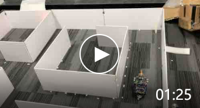
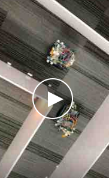

# 灭火机器人项目

## 介绍
2018年和XP Zhao，RY Li组队完成的机器人比赛项目，前后耗时三个月左右，一边上课一边做。结果还不错拿了特等奖。

比赛任务：
给定一个横平竖直的迷宫，在90度角的角落可能存在火焰，需要做两个小车从给定的起始位置出发，分别完成上半图和下半图的搜索和灭火任务，完成后回到起始位置。

评分标准：
用时尽可能短，小车不可与迷宫墙壁发生碰触，火焰只有被吹灭才算分，只探测到没有分。

## 解决方案

### 所需器材
使用STM32的板子，不带操作系统，裸机即可。其它器件：
超声波（x3）、红外传感器（x2）、编码器（x2）、舵机（x2）、小风扇、变压器、电池、万向轮等

### 控制算法
导航：由于迷宫给定，直接使用固定路径即可，前超声波第几次检测到前面墙，根据这个执行既定的转向

沿墙走：车身使用PID算法控制与墙体距离，太近则降低原理墙体的轮子速度，太远降低靠近墙体的轮子速度。 在正常区间内两轮全速前进。

火焰检测：红外传感器检测红外强度判断火焰存在，阈值受环境影响，有阳光时该阈值偏高，换场地后需要重新调参。

灭火：车身向火焰方向转45度，使车身前的风扇正对火焰，吹风灭火，二次检测，回正。

转向：左转则左轮逆转，右轮正转。旋转的幅度由编码器闭环控制，也可以延时直接开环效果也不错。

滤波：超声波检测结果有噪声，可用卡尔曼滤波过滤。

## Demo
单车Demo

双车Demo：

